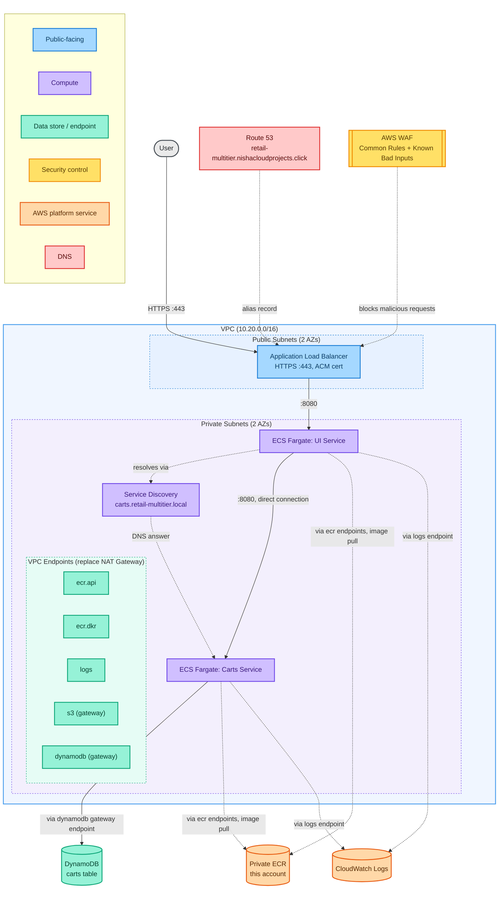
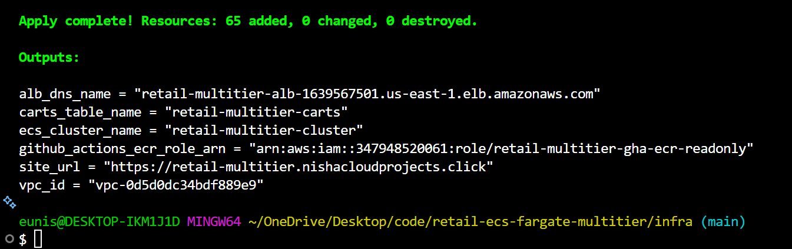
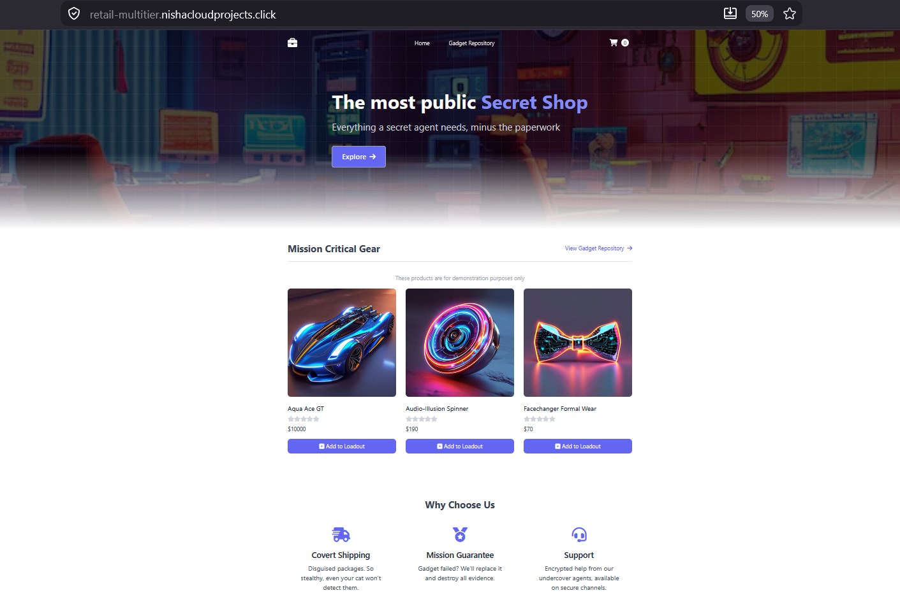
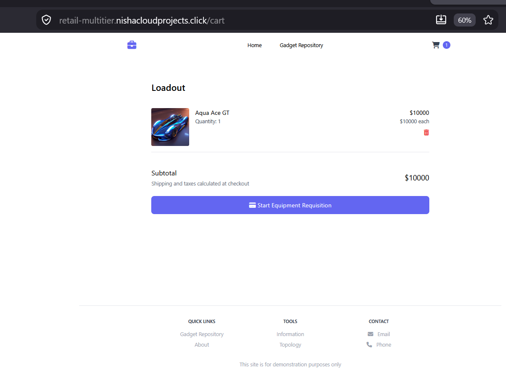
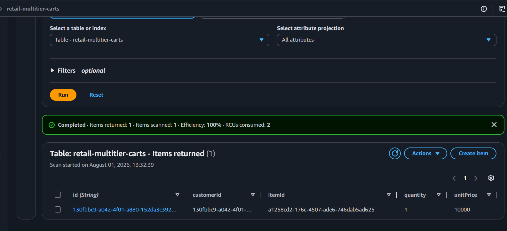

# Multi-Tier ECS Fargate Deployment

A security-conscious deployment of AWS's [retail-store-sample-app](https://github.com/aws-containers/retail-store-sample-app) on Amazon ECS Fargate, built and documented in phases as complexity increases.

This project uses the sample application as the workload, but the infrastructure, security posture, and deployment approach are original work.

## Architecture



Solid arrows are application traffic. Dashed arrows are infrastructure and control plane traffic (image pulls, log shipping, DNS) routed through VPC endpoints instead of a NAT Gateway. Task definitions pull from a private ECR mirror in this account, not directly from `public.ecr.aws` (see `scripts/mirror-images.sh` and `docs/architecture.md` for why). This diagram reflects Phase 1 only. See `docs/architecture.md` for the full five-service target architecture.

## Why this project exists

This project replaces an earlier attempt at AWS's own ECS Immersion Day workshop, whose CloudFormation template turned out to have a broken, region-locked dependency that couldn't be fixed from the consumer side. This project deploys the same underlying application using original OpenTofu instead.

## Phased approach

| Phase | Services | New AWS dependencies | Status |
|---|---|---|---|
| 1 | UI + Carts | DynamoDB | Deployed and verified |
| 2 | + Catalog | Aurora MySQL (Serverless v2) | Planned |
| 3 | + Checkout, Orders | ElastiCache Redis, Aurora PostgreSQL, Amazon MQ | Planned |

## Phase 1 architecture

- VPC with public subnets (ALB) and private subnets (Fargate tasks) across 2 AZs
- No NAT Gateway. Outbound access for ECR image pulls, CloudWatch Logs, and DynamoDB is handled via VPC interface and gateway endpoints instead, a direct, cost-driven alternative to the NAT Gateway pattern used in AWS's own ECS Immersion Day workshop.
- Public Application Load Balancer with HTTPS (ACM certificate, DNS-validated via Route 53). HTTP requests on port 80 redirect to HTTPS rather than serving plaintext traffic.
- Custom subdomain (`retail-multitier.nishacloudprojects.click`) via a Route 53 alias record pointing at the ALB
- ECS Cluster (Fargate) running UI and Carts services
- DynamoDB table for cart persistence, with IAM scoped to that table's ARN specifically (not `dynamodb:*`)
- Task execution role and task role kept separate per service, per ECS best practice

See `docs/architecture.md` for the full design breakdown, including the data store rationale across all five services in the target architecture (not just the two in Phase 1).

## Repo structure

```
retail-ecs-fargate-multitier/
├── infra/                        OpenTofu configuration (flat structure, single environment)
│   ├── alb.tf
│   ├── dns.tf
│   ├── dynamodb.tf
│   ├── ecr.tf
│   ├── ecs-carts.tf
│   ├── ecs-cluster.tf
│   ├── ecs-ui.tf
│   ├── endpoints.tf
│   ├── github-oidc.tf
│   ├── iam.tf
│   ├── logs.tf
│   ├── outputs.tf
│   ├── providers.tf
│   ├── securitygroups.tf
│   ├── variables.tf
│   ├── vpc.tf
│   ├── waf.tf
│   ├── .checkovignore           Documented, justified Checkov exceptions
│   └── terraform.tfvars.example
├── scripts/
│   └── mirror-images.sh          One-time public->private ECR image mirroring
├── docs/
│   ├── architecture.md           Design decisions, diagram, verification log
│   └── images/
│       └── phase1/               Deployment evidence screenshots
├── .github/
│   └── workflows/
│       └── pipeline.yml          CI: Checkov, Gitleaks, Trivy (OIDC-authenticated)
├── .gitignore
└── README.md
```

## Prerequisites

- OpenTofu >= 1.6
- AWS CLI configured with appropriate credentials
- Access to the existing remote state backend (S3 bucket and DynamoDB lock table; see `infra/providers.tf`. This project reuses infrastructure already provisioned for other projects rather than creating its own.)
- An existing Route 53 public hosted zone for the domain referenced in `infra/variables.tf`

## Getting started

```bash
cd infra
tofu init
tofu validate
tofu plan
```

Review the plan output fully before applying anything.

```bash
tofu apply
```

**Then, before the ECS services can successfully start:** this project pulls two images from `public.ecr.aws`, which is not reliably reachable from a private subnet with no NAT Gateway (confirmed the hard way, see `docs/architecture.md`). The task definitions pull from private ECR mirrors instead, which must be populated once:

```bash
./scripts/mirror-images.sh
```

If the ECS services are already running and stuck retrying a failed pull, the script's final output includes the two commands to force a fresh deployment so they pick up the now-available images immediately.

## Deployed


*`tofu apply` completing successfully, showing the resource count and outputs block.*


*The deployed UI, live at the custom subdomain with a valid TLS certificate.*


*An item added to the cart through the live UI.*


*The same item confirmed in the DynamoDB table via a direct scan, verifying the full request path actually persisted data end to end.*

## Status

**Phase 1 is complete: deployed, debugged, and verified end-to-end.**

Infrastructure deployed cleanly on first apply. Getting the application actually working required root-causing two separate infrastructure issues (Public ECR image pulls not reachable via the private-ECR VPC endpoints; resolved by mirroring both images into a private ECR repository in this account) and one application-layer configuration bug (a mismatched environment variable name on the UI service caused it to silently call itself instead of the Carts service, meaning the app appeared fully functional while never actually writing to DynamoDB). All three are documented in full, including the diagnostic process, in the Decisions and Verification Log in `docs/architecture.md`.

Verified working via direct evidence, not just healthy status checks: a cart item added through the live UI was confirmed present in the DynamoDB table via a direct scan.

The infrastructure has since been torn down between sessions to control cost, a deliberate choice for this personal project, not an indication anything is broken. See `docs/architecture.md` for the full debugging narrative and the "Getting started" section above to redeploy.
