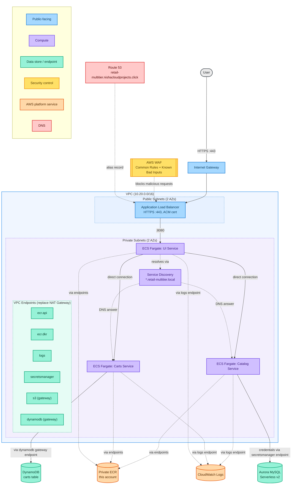
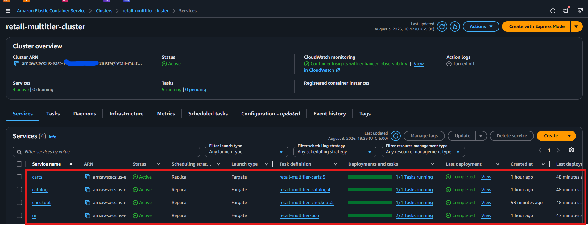
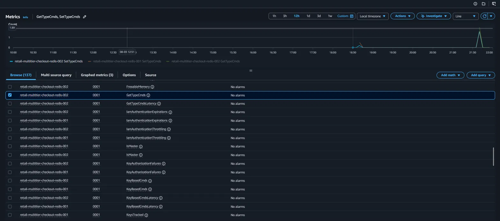

# Multi-Tier ECS Fargate Deployment

[](https://github.com/nisha318/retail-ecs-fargate-multitier/actions/workflows/pipeline.yml)
[](LICENSE)

A security-conscious deployment of AWS's [retail-store-sample-app](https://github.com/aws-containers/retail-store-sample-app) on Amazon ECS Fargate, built and documented in phases as complexity increases.

This project uses the sample application as the workload, but the infrastructure, security posture, and deployment approach are original work.

## Architecture



Solid arrows are application traffic. Dashed arrows are infrastructure and control plane traffic (image pulls, log shipping, DNS) routed through VPC endpoints instead of a NAT Gateway. Task definitions pull from a private ECR mirror in this account, not directly from `public.ecr.aws` (see [`scripts/mirror-images.sh`](scripts/mirror-images.sh) and [`docs/DECISIONS.md`](docs/DECISIONS.md) for why). This diagram reflects the current deployed state (Phase 1 + Phase 2). See [`docs/architecture.md`](docs/architecture.md) for the per-phase historical diagrams and the full five-service target architecture.

## Why this project exists

This project replaces an earlier attempt at AWS's own ECS Immersion Day workshop, whose CloudFormation template turned out to have a broken, region-locked dependency that couldn't be fixed from the consumer side. This project deploys the same underlying application using original OpenTofu instead.

## Phased approach

| Phase | Services | New AWS dependencies | Status |
|---|---|---|---|
| 1 | UI + Carts | DynamoDB | Deployed and verified |
| 2 | + Catalog | Aurora MySQL (Serverless v2) | Deployed and verified |
| 3 | + Checkout, Orders | ElastiCache Redis, Aurora PostgreSQL, Amazon MQ | Checkout deployed and verified; Orders planned |

## Phase 1 architecture

- VPC with public subnets (ALB) and private subnets (Fargate tasks) across 2 AZs
- No NAT Gateway. Outbound access for ECR image pulls, CloudWatch Logs, and DynamoDB is handled via VPC interface and gateway endpoints instead, a direct, cost-driven alternative to the NAT Gateway pattern used in AWS's own ECS Immersion Day workshop.
- Public Application Load Balancer with HTTPS (ACM certificate, DNS-validated via Route 53). HTTP requests on port 80 redirect to HTTPS rather than serving plaintext traffic.
- Custom subdomain (`retail-multitier.nishacloudprojects.click`) via a Route 53 alias record pointing at the ALB
- ECS Cluster (Fargate) running UI and Carts services
- DynamoDB table for cart persistence, with IAM scoped to that table's ARN specifically (not `dynamodb:*`)
- Task execution role and task role kept separate per service, per ECS best practice

See [`docs/architecture.md`](docs/architecture.md) for the full design breakdown, including the data store rationale across all five services in the target architecture (not just the two in Phase 1).

## Phase 2 architecture

- ECS Fargate Catalog service, added to the same cluster and VPC as Phase 1, no new networking required
- Aurora MySQL Serverless v2 for Catalog's product data. Master password is Terraform-generated (`random_password`, no special characters), not AWS-managed, a deliberate reversal from the original design after AWS's managed-password feature generated a password containing a MySQL-DSN-breaking character and caused a real outage. See [`docs/DECISIONS.md`](docs/DECISIONS.md) (ADR-010) for the full story.
- `min_capacity = 0` on Aurora, enabling auto-pause when idle, since this project gets torn down between sessions rather than left running, though note: a health check that queries the database every 15 seconds (Catalog's own) can itself prevent auto-pause from ever engaging, confirmed the hard way while capturing Phase 3 evidence
- Catalog gets its **own dedicated task execution role**, not the shared one UI and Carts use, so read access to Aurora's credentials stays scoped to Catalog only
- Secrets Manager reached via VPC interface endpoint, same PrivateLink pattern as everything else in this project, no NAT Gateway involved
- Catalog is internal-only, reachable via service discovery exactly like Carts, no public exposure or ALB target group
- Closes Phase 1's known gap: UI's Catalog integration (`RETAIL_UI_ENDPOINTS_CATALOG`) now resolves correctly, confirmed via a live screenshot of real, Aurora-backed product data

## Phase 3 architecture (Checkout deployed; Orders planned)

- ECS Fargate Checkout service (Node.js/NestJS), added to the same cluster and VPC as Phases 1 and 2
- ElastiCache Redis with genuine primary/reader replication (`automatic_failover_enabled`, `multi_az_enabled`), not a single-node shortcut, confirmed necessary by reading Checkout's own source: it opens two separate `ioredis` clients, one against each endpoint, not one endpoint accepted and ignored
- Both Redis connection strings (writer and reader, full URL with the AUTH token embedded) stored as Terraform-generated Secrets Manager secrets, same pattern as Aurora's password after ADR-010, `random_password` with no special characters, since ElastiCache has no AWS-managed auto-password equivalent to begin with
- Checkout gets its **own dedicated task execution role**, same least-privilege pattern as Catalog, scoped to read only its two Redis secrets
- `RETAIL_CHECKOUT_ENDPOINTS_ORDERS` deliberately left empty. Checkout's own documentation describes a graceful mock fallback for this case, confirmed before deploying, not an undocumented risk like Phase 1's original UI/Carts bug
- Health check uses Checkout's real `/health` endpoint, confirmed to be liveness-only (it does not verify Redis connectivity). Real proof that Checkout actually reads and writes to Redis came from CloudWatch's `SetTypeCmds`/`GetTypeCmds` metrics correlated against real application traffic timestamps, not from the health check. See [`docs/architecture.md`](docs/architecture.md) Deployment evidence and [`docs/DECISIONS.md`](docs/DECISIONS.md) (ADR-009) for the full verification story
- Orders is not yet built. Once it exists, Checkout's own source needs re-checking to resolve an open question: it calls Orders via direct HTTP today, which contradicts an early assumption (baked into the Logical Service diagram) that Checkout publishes to Amazon MQ instead

## Repo structure

```
retail-ecs-fargate-multitier/
├── infra/                        OpenTofu configuration (flat structure, single environment)
│   ├── alb.tf
│   ├── dns.tf
│   ├── dynamodb.tf
│   ├── ecr.tf
│   ├── ecs-carts.tf
│   ├── ecs-cluster.tf
│   ├── ecs-ui.tf
│   ├── endpoints.tf
│   ├── github-oidc.tf
│   ├── iam.tf
│   ├── logs.tf
│   ├── outputs.tf
│   ├── providers.tf
│   ├── securitygroups.tf
│   ├── variables.tf
│   ├── vpc.tf
│   ├── waf.tf
│   ├── .checkovignore           Documented, justified Checkov exceptions
│   └── terraform.tfvars.example
├── scripts/
│   └── mirror-images.sh          One-time public->private ECR image mirroring
├── docs/
│   ├── architecture.md           Current architecture reference: diagrams, service scope, cost
│   ├── DECISIONS.md              Architecture Decision Records: why, in ADR format
│   └── images/
│       └── phase1/               Deployment evidence screenshots
├── .github/
│   └── workflows/
│       └── pipeline.yml          CI: Checkov, Gitleaks, Trivy (OIDC-authenticated)
├── .gitignore
└── README.md
```

## Prerequisites

- OpenTofu >= 1.6
- AWS CLI configured with appropriate credentials
- Access to the existing remote state backend (S3 bucket and DynamoDB lock table; see [`infra/providers.tf`](infra/providers.tf). This project reuses infrastructure already provisioned for other projects rather than creating its own.)
- An existing Route 53 public hosted zone for the domain referenced in [`infra/variables.tf`](infra/variables.tf)

## Getting started

```bash
cd infra
tofu init
tofu validate
tofu plan
```

Review the plan output fully before applying anything.

```bash
tofu apply
```

**Then, before the ECS services can successfully start:** this project pulls two images from `public.ecr.aws`, which is not reliably reachable from a private subnet with no NAT Gateway (confirmed the hard way, see [`docs/DECISIONS.md`](docs/DECISIONS.md), ADR-006). The task definitions pull from private ECR mirrors instead, which must be populated once:

```bash
./scripts/mirror-images.sh
```

If the ECS services are already running and stuck retrying a failed pull, the script's final output includes the two commands to force a fresh deployment so they pick up the now-available images immediately.

## Deployed


*`tofu apply` completing successfully, showing the resource count and outputs block.*


*The deployed UI, live at the custom subdomain with a valid TLS certificate.*


*An item added to the cart through the live UI.*


*Phase 2: real Aurora-backed product data rendering through UI's product detail page, not just the listing page, confirming the full UI-to-Catalog-to-Aurora chain works end to end.*


*The same item confirmed in the DynamoDB table via a direct scan, verifying the full request path actually persisted data end to end.*


*Phase 3: Checkout joins the other three services, all "Completed" with stable task counts.*


*The real proof Checkout works, not the health check: a 12-hour window showing true zero Redis command activity except for one clear spike lining up precisely with real application traffic timestamps in CloudWatch Logs, confirming Checkout genuinely reads and writes to Redis. See [`docs/DECISIONS.md`](docs/DECISIONS.md) (ADR-009) for why the health check alone couldn't prove this.*

## Status

**Phase 1 is complete: deployed, debugged, and verified end-to-end.**

Infrastructure deployed cleanly on first apply. Getting the application actually working required root-causing two separate infrastructure issues (Public ECR image pulls not reachable via the private-ECR VPC endpoints; resolved by mirroring both images into a private ECR repository in this account) and one application-layer configuration bug (a mismatched environment variable name on the UI service caused it to silently call itself instead of the Carts service, meaning the app appeared fully functional while never actually writing to DynamoDB). All three are documented in full, including the diagnostic process, in [`docs/DECISIONS.md`](docs/DECISIONS.md) (ADR-006 and ADR-007).

Verified working via direct evidence, not just healthy status checks: a cart item added through the live UI was confirmed present in the DynamoDB table via a direct scan.

**Phase 2 is also complete: Catalog and Aurora MySQL deployed, debugged, and verified.**

Aurora's connectivity and the application's own database migration worked correctly on the very first attempt, confirmed directly in CloudWatch Logs. The actual bug was different from Phase 1's: Catalog's task health check trusted the service's own documented "test access" endpoint (`/catalogue`), which turned out to be wrong for the deployed version. The logs made this unambiguous, the health check's `/catalogue` requests returned a clean `404` on a 15-second loop, while genuine traffic from UI was simultaneously succeeding against `/catalog/products` in the same log stream. Fixed by pointing the health check at the path already confirmed working from real traffic, not another guess from documentation.

Verified working via direct evidence again: the live `/catalog` page renders real, Aurora-backed product data (GORM auto-seeds it on startup), not just a passing health check, see the product detail screenshot in the [Deployed](#deployed) section above.

A second, unrelated Catalog incident surfaced later, after a full teardown and redeploy: AWS's managed password generator produced a password containing a MySQL-DSN-breaking character, causing a real outage despite Aurora itself connecting successfully. Fixed by switching to a Terraform-generated password with no special characters at all, full story in [`docs/DECISIONS.md`](docs/DECISIONS.md) (ADR-010).

**Phase 3 is in progress: Checkout and ElastiCache Redis deployed, debugged, and verified; Orders not yet built.**

Checkout's configuration was fully confirmed against its own source before writing any infrastructure, not assumed, including a real finding: the service's own `/health` endpoint only checks a chaos-simulation flag and never verifies Redis connectivity, so a passing health check alone would not have been trustworthy evidence. Real proof came from CloudWatch's `SetTypeCmds`/`GetTypeCmds` metrics correlated directly against real application traffic, confirming Checkout genuinely reads and writes to Redis, full story in [`docs/DECISIONS.md`](docs/DECISIONS.md) (ADR-009).

Orders is deliberately deferred. Checkout's endpoint to it is left empty, using the service's own documented graceful mock fallback rather than an undocumented risk, so Checkout was built, deployed, and fully verified on its own before Orders exists.

The infrastructure has since been torn down between sessions to control cost, a deliberate choice for this personal project, not an indication anything is broken. See [`docs/DECISIONS.md`](docs/DECISIONS.md) for the full debugging narrative, [`docs/architecture.md`](docs/architecture.md) for current architecture reference, and the "Getting started" section above to redeploy.
