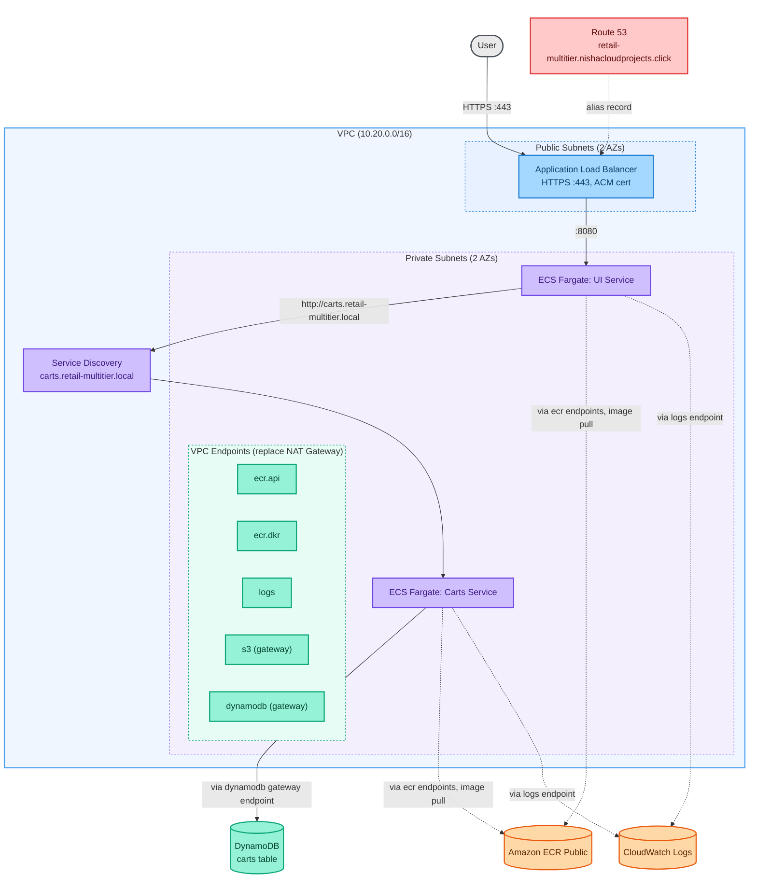

# Multi-Tier ECS Fargate Deployment

A security-conscious deployment of AWS's [retail-store-sample-app](https://github.com/aws-containers/retail-store-sample-app) on Amazon ECS Fargate, built and documented in phases as complexity increases.

This project uses the sample application as the workload, but the infrastructure, security posture, and deployment approach are original work.

## Architecture



Solid arrows are application traffic. Dashed arrows are infrastructure and control plane traffic (image pulls, log shipping, DNS) routed through VPC endpoints instead of a NAT Gateway. This diagram reflects Phase 1 only. See `docs/architecture.md` for the full five-service target architecture.

## Why this project exists

This project replaces an earlier attempt at AWS's own ECS Immersion Day workshop, whose CloudFormation template turned out to have a broken, region-locked dependency that couldn't be fixed from the consumer side. This project deploys the same underlying application using original OpenTofu instead.

## Phased approach

| Phase | Services | New AWS dependencies | Status |
|---|---|---|---|
| 1 | UI + Carts | DynamoDB | Infrastructure complete, not yet deployed |
| 2 | + Catalog | Aurora MySQL (Serverless v2) | Planned |
| 3 | + Checkout, Orders | ElastiCache Redis, Aurora PostgreSQL, Amazon MQ | Planned |

## Phase 1 architecture

- VPC with public subnets (ALB) and private subnets (Fargate tasks) across 2 AZs
- No NAT Gateway. Outbound access for ECR image pulls, CloudWatch Logs, and DynamoDB is handled via VPC interface and gateway endpoints instead, a direct, cost-driven alternative to the NAT Gateway pattern used in AWS's own ECS Immersion Day workshop.
- Public Application Load Balancer with HTTPS (ACM certificate, DNS-validated via Route 53). HTTP requests on port 80 redirect to HTTPS rather than serving plaintext traffic.
- Custom subdomain (`retail-multitier.nishacloudprojects.click`) via a Route 53 alias record pointing at the ALB
- ECS Cluster (Fargate) running UI and Carts services
- DynamoDB table for cart persistence, with IAM scoped to that table's ARN specifically (not `dynamodb:*`)
- Task execution role and task role kept separate per service, per ECS best practice

See `docs/architecture.md` for the full design breakdown, including the data store rationale across all five services in the target architecture (not just the two in Phase 1).

## Repo structure

```
infra/       OpenTofu configuration (flat structure, single environment)
docs/        Architecture notes, diagrams, and phase planning
.github/     CI pipeline (Trivy, Checkov, Gitleaks)
```

## Prerequisites

- OpenTofu >= 1.6
- AWS CLI configured with appropriate credentials
- Access to the existing remote state backend (S3 bucket and DynamoDB lock table; see `infra/providers.tf`. This project reuses infrastructure already provisioned for other projects rather than creating its own.)
- An existing Route 53 public hosted zone for the domain referenced in `infra/variables.tf`

## Getting started

```bash
cd infra
tofu init
tofu validate
tofu plan
```

Review the plan output fully before applying anything.

```bash
tofu apply
```

## Status

Phase 1 infrastructure is fully written, and every previously open configuration question has been confirmed against real sources (container image names and tags verified via `docker pull`; Carts environment variables confirmed against AWS's own EKS Workshop documentation). Not yet deployed. Two items remain to verify during first apply rather than beforehand. See `docs/architecture.md` for details.
