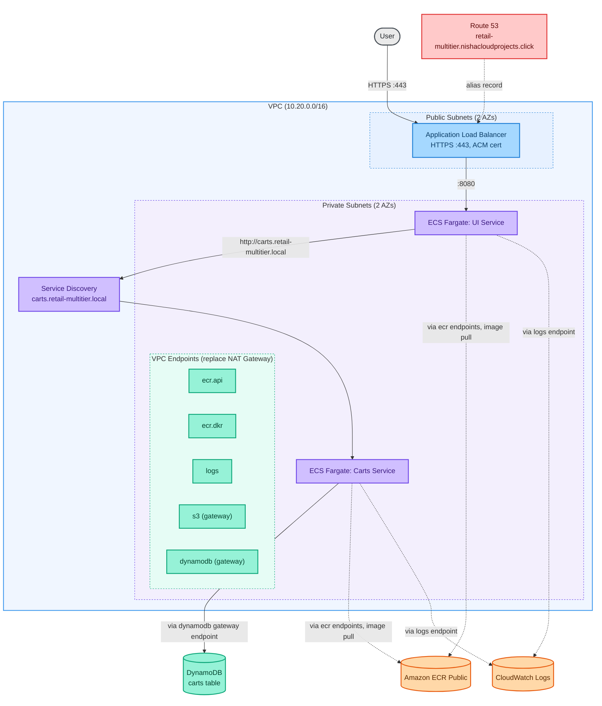

# Architecture Notes, Phase 1

## Infrastructure decision: shared state backend, reused hosted zone

This project reuses existing shared infrastructure for two things rather than provisioning fresh copies:

- **State backend**: the `anvil-tofu-state` S3 bucket and `tofu-state-lock-dev` DynamoDB table are shared across projects (including `container-security-progression`). This project uses its own distinct state key (`retail-ecs-fargate-multitier/terraform.tfstate`) so its state can never collide with another project's in the same bucket.
- **Route 53 hosted zone**: `nishacloudprojects.click` is looked up via `data "aws_route53_zone"` rather than created fresh. Domain reuse across projects (via subdomains) avoids repeated registration and zone management overhead.

## Diagram

Solid arrows are application traffic. Dashed arrows are infrastructure and control plane traffic (image pulls, log shipping) that would normally require a NAT Gateway but is routed through VPC endpoints instead in this build.

## Services in scope

**UI**: public.ecr.aws/aws-containers/retail-store-sample-ui
Frontend service. Routes to Catalog and Carts in the full app. In Phase 1, with Catalog not yet deployed, catalog-dependent pages will not resolve correctly. This is expected Phase 1 behavior, resolved in Phase 2.

**Carts**: public.ecr.aws/aws-containers/retail-store-sample-cart (confirmed singular repository name via `docker pull`)
Supports either MongoDB or DynamoDB as a persistence backend. This build uses DynamoDB.

## Networking decision: VPC endpoints instead of NAT Gateway

The ECS Immersion Day workshop template provisions 3 NAT Gateways (one per AZ) for general outbound access from private subnets. For a two service Phase 1 build, the only outbound needs are:
- Pulling container images from ECR (public and, later, private)
- Shipping logs to CloudWatch Logs
- DynamoDB access, via its own gateway endpoint

Interface endpoints needed:
- `com.amazonaws.<region>.ecr.api`
- `com.amazonaws.<region>.ecr.dkr`
- `com.amazonaws.<region>.logs`

Gateway endpoints needed:
- `com.amazonaws.<region>.dynamodb`
- `com.amazonaws.<region>.s3` (ECR image layers are stored in S3 behind the scenes; the DKR endpoint alone is not sufficient. This needs verification during first deploy, see the Decisions and Verification Log.)

## IAM decision: least privilege over `dynamodb:*`

The reference workshop's carts task role uses `dynamodb:*` on `Resource: "*"`. This build scopes the carts task role to the specific table ARN and only the actions the service actually needs (get, put, update, query, delete item, describe table). Exact action list to be confirmed against the container's actual DynamoDB calls (see the Decisions and Verification Log).

## DynamoDB table schema

Reused from AWS's own ECS Immersion Day CloudFormation template (confirmed accurate from that source):

- Table name: `retail-store-ecs-carts` (rename per this project's convention before apply)
- Partition key: `id` (String)
- Billing mode: PAY_PER_REQUEST
- GSI: `idx_global_customerId`, partition key `customerId` (String), projects ALL

## Data store rationale

Each of the five services in the full architecture uses a different data store, chosen to match how that service actually reads and writes data rather than standardizing on one database technology across the board.

| Service | Access pattern | Store chosen |
|---|---|---|
| Carts | Simple key-value lookups by cart ID, high write volume, no complex joins | DynamoDB |
| Catalog | Structured product data, relational queries | Aurora MySQL |
| Orders | Transactional integrity, relational queries | Aurora PostgreSQL |
| Checkout | Fast ephemeral session and cache data | Redis |

**Carts, DynamoDB.** Access is almost entirely single-item lookups by cart ID, high write volume, no joins. The Carts table uses partition key `id` for the primary access path and a GSI on `customerId` as a secondary lookup, a standard single-table DynamoDB design for this access pattern.

**Catalog, Aurora MySQL.** Product data is relational: categories, hierarchies, and filtered queries across multiple related tables. Aurora Serverless v2 scales to the bursty read traffic typical of a browsing-heavy catalog service, with writes (product updates) comparatively rare.

**Orders, Aurora PostgreSQL.** This is the service where correctness has real consequences. ACID transactions are the core requirement, which both Aurora engines provide. Postgres over MySQL here reflects its typically stricter typing and more advanced constraint handling, appropriate for the source-of-truth service in the system. Splitting Catalog and Orders across two different Aurora engines is itself a form of polyglot persistence within the relational category.

**Checkout, Redis.** Checkout state is short-lived by design: it matters intensely for a few minutes during an active checkout and is worthless afterward. Redis gives sub-millisecond access during a latency-sensitive flow, with TTL expiration handling the data's natural lifecycle, without paying for a durable relational store for data meant to disappear.

Reference: AWS Prescriptive Guidance, [Enabling data persistence in microservices](https://docs.aws.amazon.com/prescriptive-guidance/latest/modernization-data-persistence/introduction.html)

## Decisions and Verification Log

### Confirmed

1. **Carts service environment variables** confirmed against AWS's own EKS Workshop documentation (eksworkshop.com/docs/security/iam-roles-for-service-accounts/using-dynamo, backed by github.com/aws-samples/eks-workshop-v2). Real config: `RETAIL_CART_PERSISTENCE_PROVIDER=dynamodb`, `RETAIL_CART_PERSISTENCE_DYNAMODB_TABLE_NAME=<table name>`. `RETAIL_CART_PERSISTENCE_DYNAMODB_ENDPOINT` intentionally omitted (only used to point at a local or test DynamoDB container; omitting it makes the SDK default to real AWS DynamoDB). No static AWS credentials: the task role supplies those.

   This source is EKS-specific documentation, not ECS-specific. The variable names are treated as valid for this ECS deployment because they are read by the application itself inside the container, not by the orchestrator: the same container image runs unchanged on both platforms, and environment variables are a generic mechanism regardless of whether they arrive via a Kubernetes ConfigMap or an ECS task definition. This is a cross-platform inference, not a direct ECS-native confirmation. An ECS-specific source for the same configuration has not been located.

2. **Image tags**: `public.ecr.aws/aws-containers/retail-store-sample-cart:1.2.4` confirmed pullable via `docker pull` (digest `sha256:57e5df70...`). Repository name (singular `cart`) and tag are both real and current as of this check.

3. **Repository naming, "cart" vs. "carts"**: confirmed via `docker pull public.ecr.aws/aws-containers/retail-store-sample-cart:1.2.4`, which succeeded. The current main branch of `aws-containers/retail-store-sample-app` names the service singular: source at `src/cart`, container image `retail-store-sample-cart`, Helm chart `retail-store-sample-cart-chart`. The older ECS Immersion Day workshop template (and the EKS Workshop docs used to confirm item 1) reference the now outdated plural `carts`/`retail-store-sample-carts`. `infra/variables.tf` uses the confirmed correct singular image name.

### Verifying during first deploy

1. **UI service catalog dependency behavior**: confirm what the UI actually does when Catalog is unreachable (error page vs. partial render).

### Confirmed the hard way, during first deploy

1. **Public ECR requires its own dedicated VPC endpoint, separate from private ECR.** First `tofu apply` succeeded, but both ECS services stayed at 0 running tasks indefinitely. ECS service Events showed `CannotPullContainerError: ... failed to resolve ref public.ecr.aws/... dial tcp ...: i/o timeout`. Root cause: the `ecr.api` / `ecr.dkr` interface endpoints only provide private connectivity to *private* ECR repositories in this account. They do not cover `public.ecr.aws` (Amazon ECR Public Gallery) at all, which is what both container images in this project actually pull from. AWS's own documentation confirms Public ECR is reachable via VPC endpoint only through a separate `ecr-public` service endpoint, and only in `us-east-1`. Fixed by adding a dedicated `aws_vpc_endpoint.ecr_public` resource (see `endpoints.tf`), with a `precondition` that fails cleanly at plan time if this project is ever deployed outside `us-east-1`, rather than surfacing as a confusing runtime timeout in a different region. This resolves what the original item 1 in this list ("S3 gateway endpoint requirement") was circling without naming precisely: the real gap wasn't S3, it was that Public ECR was never reachable through the private-ECR endpoints in the first place.

## Cost profile (Phase 1, approximate, us-east-1)

- No NAT Gateway (removes about $32 to $96 per month plus data processing, versus the workshop's 3x NAT setup)
- ALB: about $16 to $20 per month baseline plus LCU usage
- Fargate (2 services, minimal task size, not running 24/7): pennies per hour while active
- DynamoDB PAY_PER_REQUEST: near zero at this usage scale
- VPC interface endpoints: hourly charge per endpoint per AZ, about $7 to $8 per month each. VPC endpoints are not automatically cheaper than a single NAT Gateway at low service counts; the economics shift as more services and endpoints are added in later phases.

## Deployment evidence

📸 **Screenshot:** ECS console, `ui` and `carts` services both showing healthy task counts

📸 **Screenshot:** VPC resource map, showing the actual subnet/route table/endpoint layout matching the architecture diagram above

📸 **Screenshot:** WAFv2 web ACL, both managed rule groups attached (and sampled request metrics, once there's been some traffic)

📸 **Screenshot:** CloudWatch Logs, `/ecs/retail-multitier` log group showing real application logs, KMS-encrypted (lock icon visible in console)

📸 **Screenshot:** Route 53 hosted zone after apply, showing the new cert-validation CNAME and the ALB alias A record that Terraform created automatically

📸 **Screenshot:** GitHub Actions, the final green pipeline run, paired with an earlier failing run for the "broken pipeline → root-caused → fixed" arc

📸 **Screenshot:** Cost Explorer, a day or two after deployment, actual per-service cost breakdown to compare against the estimates above
