# Architecture Notes

## Infrastructure decision: shared state backend, reused hosted zone

This project reuses existing shared infrastructure for two things rather than provisioning fresh copies:

- **State backend**: the `anvil-tofu-state` S3 bucket and `tofu-state-lock-dev` DynamoDB table are shared across projects (including `container-security-progression`). This project uses its own distinct state key (`retail-ecs-fargate-multitier/terraform.tfstate`) so its state can never collide with another project's in the same bucket.
- **Route 53 hosted zone**: `nishacloudprojects.click` is looked up via `data "aws_route53_zone"` rather than created fresh. Domain reuse across projects (via subdomains) avoids repeated registration and zone management overhead.

## Diagram

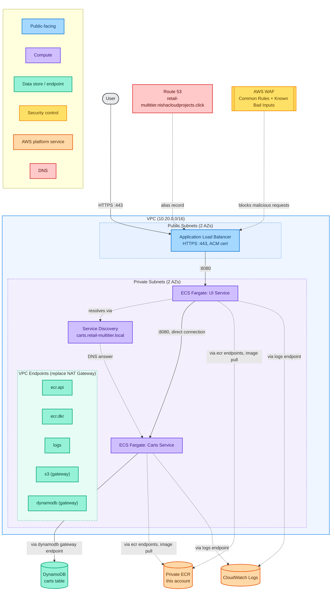

Solid arrows are application traffic. Dashed arrows are infrastructure and control plane traffic (image pulls, log shipping) that would normally require a NAT Gateway but is routed through VPC endpoints instead in this build. Task definitions pull from a private ECR mirror in this account, not directly from `public.ecr.aws`; see the Decisions and Verification Log for why.

## Services in scope

**UI**: mirrored from public.ecr.aws/aws-containers/retail-store-sample-ui into a private ECR repository ([`ecr.tf`](../infra/ecr.tf)), which is what the running task definition actually pulls from
Frontend service. Routes to Catalog and Carts. Catalog-dependent pages, previously unresolved in Phase 1 since Catalog wasn't deployed yet, now render correctly, confirmed via a live screenshot of `/catalog` showing real Aurora-backed product data (see Deployment evidence, Phase 2).

**Carts**: mirrored from public.ecr.aws/aws-containers/retail-store-sample-cart (confirmed singular repository name via `docker pull`) into a private ECR repository, same as UI
Supports either MongoDB or DynamoDB as a persistence backend. This build uses DynamoDB.

**Catalog**: mirrored from public.ecr.aws/aws-containers/retail-store-sample-catalog into a private ECR repository, same pattern as UI/Carts
Go service, MySQL persistence. Uses Aurora MySQL Serverless v2 (see Data store rationale below, and [`aurora.tf`](../infra/aurora.tf) for the actual configuration). Auto-migrates its own schema and seeds itself with demo product/tag data on startup via GORM, confirmed via `repository.go` before deploying, no manual schema or seed step required.

## Networking decision: VPC endpoints instead of NAT Gateway

The ECS Immersion Day workshop template provisions 3 NAT Gateways (one per AZ) for general outbound access from private subnets. For a two service Phase 1 build, the only outbound needs are:
- Pulling container images from ECR (public and, later, private)
- Shipping logs to CloudWatch Logs
- DynamoDB access, via its own gateway endpoint

Interface endpoints needed:
- `com.amazonaws.<region>.ecr.api`
- `com.amazonaws.<region>.ecr.dkr`
- `com.amazonaws.<region>.logs`

Gateway endpoints needed:
- `com.amazonaws.<region>.dynamodb`
- `com.amazonaws.<region>.s3` (ECR image layers are stored in S3 behind the scenes; the DKR endpoint alone is not sufficient. This needs verification during first deploy, see the Decisions and Verification Log.)

## IAM decision: least privilege over `dynamodb:*`

The reference workshop's carts task role uses `dynamodb:*` on `Resource: "*"`. This build scopes the carts task role to the specific table ARN and only the actions the service actually needs (get, put, update, query, delete item, describe table). Exact action list to be confirmed against the container's actual DynamoDB calls (see the Decisions and Verification Log).

## DynamoDB table schema

Reused from AWS's own ECS Immersion Day CloudFormation template (confirmed accurate from that source):

- Table name: `retail-store-ecs-carts` (rename per this project's convention before apply)
- Partition key: `id` (String)
- Billing mode: PAY_PER_REQUEST
- GSI: `idx_global_customerId`, partition key `customerId` (String), projects ALL

## Target architecture (all phases)

The diagram above shows Phase 1 only, UI and Carts. This is the full five-service target this project builds toward across Phases 1 through 3, shown at the infrastructure level, same style as the diagram above, extended.

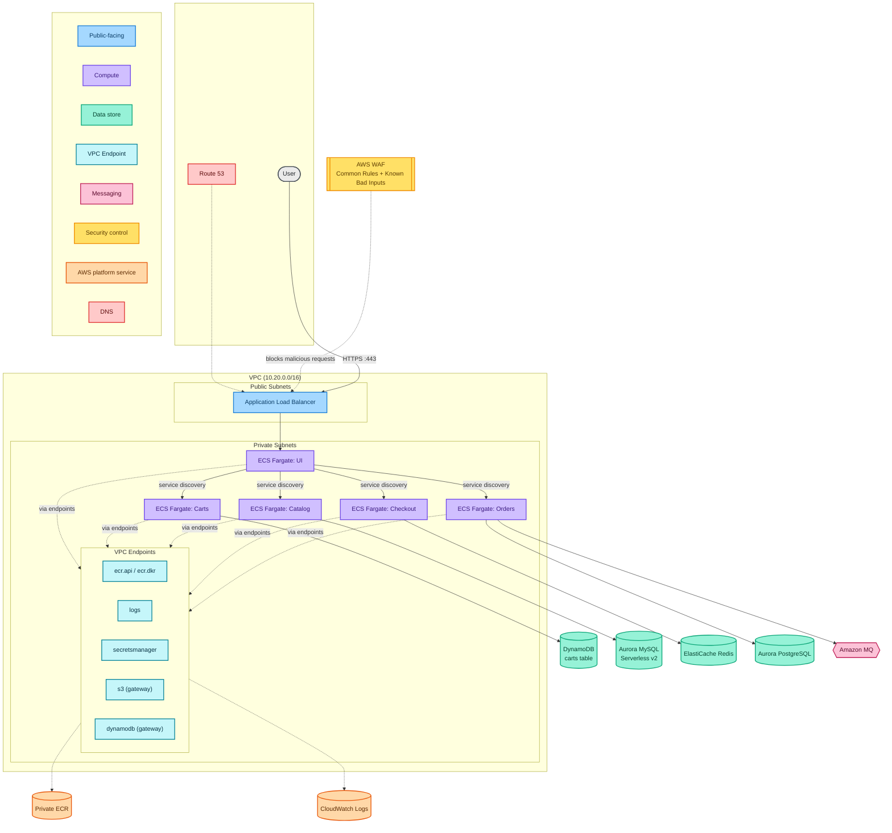
*Full target infrastructure across all three phases. Phase 1 (UI, Carts) is deployed and verified; Catalog, Checkout, and Orders are planned for Phases 2 and 3. Solid arrows are application traffic; dashed arrows are infrastructure and control-plane traffic routed through VPC endpoints.*

## Logical service architecture

The diagram above shows AWS infrastructure, VPCs, subnets, endpoints, the physical deployment. It answers "what's provisioned and how does it connect at the network level." It deliberately doesn't answer a different, equally important question: which service owns which data, and why. That's a separate concern worth its own diagram rather than overloading the infrastructure one.

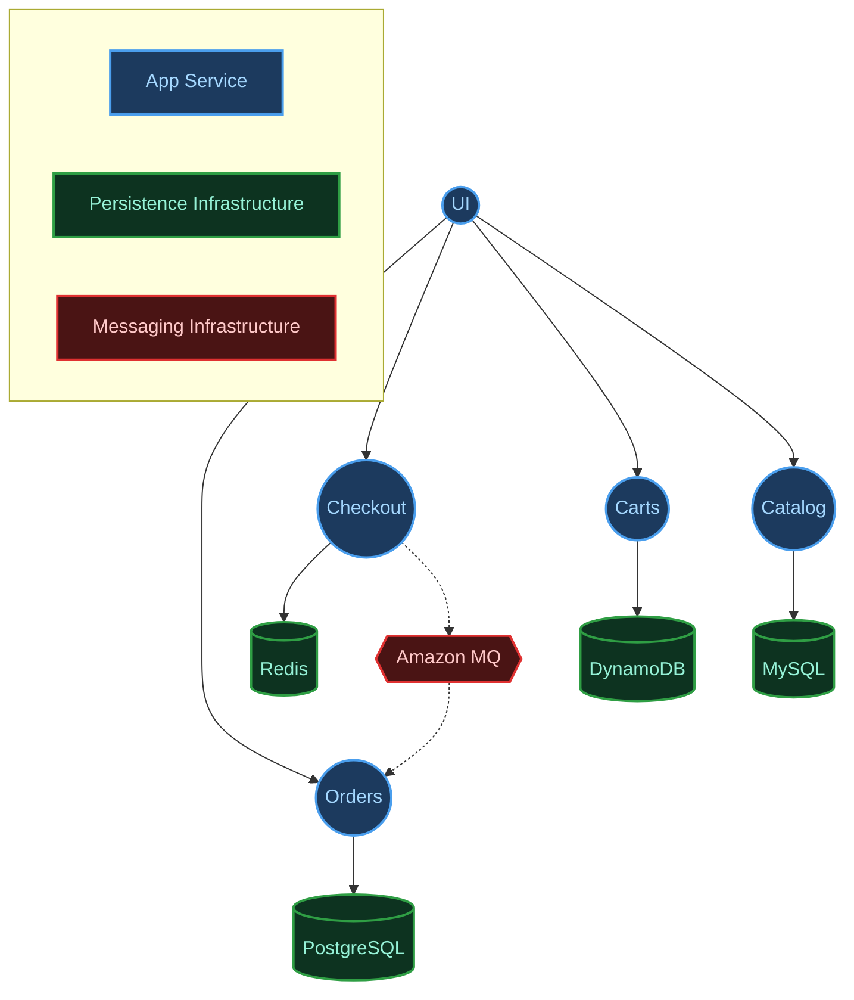
*Logical service-to-datastore dependencies, independent of AWS specifics. This is the view that explains the polyglot persistence decisions below: each service owns its data exclusively, and the technology choice per service follows from its access pattern, not from AWS's infrastructure options.*

## Data store rationale

Four of the five services in the full architecture each use a different data store, chosen to match how that service actually reads and writes data rather than standardizing on one database technology across the board. The fifth, UI, deliberately owns no data store of its own, it aggregates data from the other four services via API calls, which is exactly why it has no row in the table below.

| Service | Access pattern | Store chosen |
|---|---|---|
| Carts | Simple key-value lookups by cart ID, high write volume, no complex joins | DynamoDB |
| Catalog | Structured product data, relational queries | Aurora MySQL |
| Orders | Transactional integrity, relational queries | Aurora PostgreSQL |
| Checkout | Fast ephemeral session and cache data | Redis |

**Carts, DynamoDB.** Access is almost entirely single-item lookups by cart ID, high write volume, no joins. The Carts table uses partition key `id` for the primary access path and a GSI on `customerId` as a secondary lookup, a standard single-table DynamoDB design for this access pattern.

**Catalog, Aurora MySQL.** Product data is relational: categories, hierarchies, and filtered queries across multiple related tables. Aurora Serverless v2 scales to the bursty read traffic typical of a browsing-heavy catalog service, with writes (product updates) comparatively rare.

**Orders, Aurora PostgreSQL.** This is the service where correctness has real consequences. ACID transactions are the core requirement, which both Aurora engines provide. Postgres over MySQL here reflects its typically stricter typing and more advanced constraint handling, appropriate for the source-of-truth service in the system. Splitting Catalog and Orders across two different Aurora engines is itself a form of polyglot persistence within the relational category.

**Checkout, Redis.** Checkout state is short-lived by design: it matters intensely for a few minutes during an active checkout and is worthless afterward. Redis gives sub-millisecond access during a latency-sensitive flow, with TTL expiration handling the data's natural lifecycle, without paying for a durable relational store for data meant to disappear.

Reference: AWS Prescriptive Guidance, [Enabling data persistence in microservices](https://docs.aws.amazon.com/prescriptive-guidance/latest/modernization-data-persistence/introduction.html)

## Decisions and Verification Log

### Confirmed

1. **Carts service environment variables** confirmed against AWS's own EKS Workshop documentation (eksworkshop.com/docs/security/iam-roles-for-service-accounts/using-dynamo, backed by github.com/aws-samples/eks-workshop-v2). Real config: `RETAIL_CART_PERSISTENCE_PROVIDER=dynamodb`, `RETAIL_CART_PERSISTENCE_DYNAMODB_TABLE_NAME=<table name>`. `RETAIL_CART_PERSISTENCE_DYNAMODB_ENDPOINT` intentionally omitted (only used to point at a local or test DynamoDB container; omitting it makes the SDK default to real AWS DynamoDB). No static AWS credentials: the task role supplies those.

   This source is EKS-specific documentation, not ECS-specific. The variable names are treated as valid for this ECS deployment because they are read by the application itself inside the container, not by the orchestrator: the same container image runs unchanged on both platforms, and environment variables are a generic mechanism regardless of whether they arrive via a Kubernetes ConfigMap or an ECS task definition. This is a cross-platform inference, not a direct ECS-native confirmation. An ECS-specific source for the same configuration has not been located.

2. **Image tags**: `public.ecr.aws/aws-containers/retail-store-sample-cart:1.2.4` confirmed pullable via `docker pull` (digest `sha256:57e5df70...`). Repository name (singular `cart`) and tag are both real and current as of this check.

3. **Repository naming, "cart" vs. "carts"**: confirmed via `docker pull public.ecr.aws/aws-containers/retail-store-sample-cart:1.2.4`, which succeeded. The current main branch of `aws-containers/retail-store-sample-app` names the service singular: source at `src/cart`, container image `retail-store-sample-cart`, Helm chart `retail-store-sample-cart-chart`. The older ECS Immersion Day workshop template (and the EKS Workshop docs used to confirm item 1) reference the now outdated plural `carts`/`retail-store-sample-carts`. [`infra/variables.tf`](../infra/variables.tf) uses the confirmed correct singular image name.

### Verifying during first deploy

1. **UI service catalog dependency behavior**: confirm what the UI actually does when Catalog is unreachable (error page vs. partial render).

### Confirmed the hard way, during first deploy

1. **Public ECR requires its own dedicated VPC endpoint, separate from private ECR - but even that endpoint did not fully solve the problem.** First `tofu apply` succeeded, but both ECS services stayed at 0 running tasks indefinitely. ECS service Events showed `CannotPullContainerError: ... failed to resolve ref public.ecr.aws/... dial tcp ...: i/o timeout`. Root cause: the `ecr.api` / `ecr.dkr` interface endpoints only provide private connectivity to *private* ECR repositories in this account. They do not cover `public.ecr.aws` (Amazon ECR Public Gallery) at all, which is what both container images in this project actually pull from.

   First attempted fix: a dedicated `aws_vpc_endpoint.ecr_public` resource targeting `com.amazonaws.us-east-1.ecr-public.api` (only available in `us-east-1`; the exact service name required a `.api` suffix not obvious from documentation alone and had to be confirmed directly via `aws ec2 describe-vpc-endpoint-services`, since an initial guess at the name failed with `InvalidServiceName`). After correcting the name and re-applying, the identical error persisted, same hostname (`public.ecr.aws`), same timeout. The reason: this endpoint's private DNS names (`api.ecr-public.us-east-1.amazonaws.com`, `ecr-public.us-east-1.api.aws`) cover API/metadata calls to the ECR Public control plane, not the actual image manifest/layer pull path, which resolves `public.ecr.aws` directly and is a different hostname entirely.

   **Actual fix:** stopped trying to make `public.ecr.aws` reachable, and removed the dependency on it instead. Both images are now mirrored into private ECR repositories in this account ([`ecr.tf`](../infra/ecr.tf)), populated by a one-time script ([`scripts/mirror-images.sh`](../scripts/mirror-images.sh)), with the ECS task definitions pulling from the private mirror rather than the public gallery. This routes through the `ecr.api`/`ecr.dkr` endpoints already proven to work correctly elsewhere in this project, and is independently a reasonable supply-chain hardening step: task definitions now depend on a registry under this account's control, at a specific immutable tag, rather than on the public gallery's continued availability at deploy time.

   The `aws_vpc_endpoint.ecr_public` resource was left in place rather than removed, since it does provide genuine value for any future API-level calls to Public ECR (metadata lookups, `aws ecr-public describe-images`, etc. run from within the VPC), even though it does not cover image pulls.

2. **Catalog's documented "test access" endpoint was wrong for the deployed version, discovered via the health check that trusted it.** Catalog's task definition health check used `/catalogue`, the exact command the service's own README documents under "Running: Test access". Aurora connectivity and application startup were both confirmed working correctly in CloudWatch Logs on every single task attempt (`Using mysql database ...`, `Running database migration...`, `Database migration complete`, no retries, no errors), yet every task still failed its health check and got cycled by ECS.

   The logs made the actual cause unambiguous: every health check request against `/catalogue` returned a clean `404`, at the exact interval configured (every 15 seconds), while in the same log stream, genuine traffic from UI (source IP inside the VPC, not the health check's `localhost`) was simultaneously succeeding against `/catalog/products` and `/catalog/size` with real `200` responses. The application itself, and its integration with UI, was working the entire time; only the health check's assumed path was wrong.

   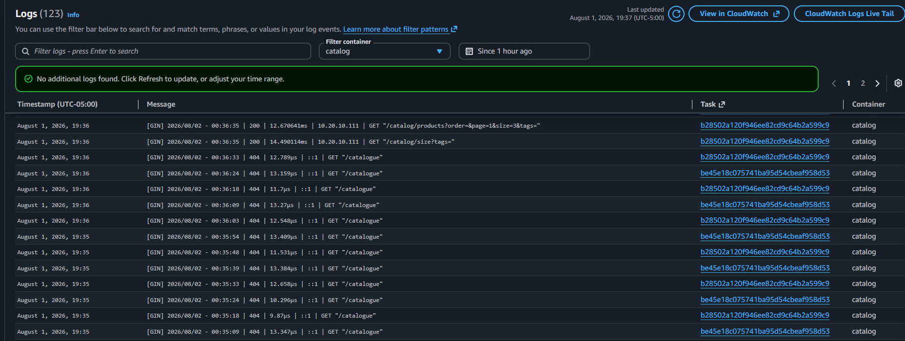
   *The exact contrast that revealed the real bug: repeated `404`s from the health check's `/catalogue` path, alongside a genuine `200` from UI's real traffic against `/catalog/products`, seconds apart in the same log stream.*

   **Fix:** changed the health check to `/catalog/products`, the exact path confirmed working via a real successful request in the logs, not another guess from documentation. This is the same category of failure as the Phase 1 UI/Carts environment variable bug, trusting written documentation over live, observed behavior, just caught this time via health check cycling rather than a silent data-persistence gap. Worth remembering as a general principle: even a service's own official README can be stale or inaccurate for the specific version actually deployed, and the only fully reliable confirmation is a real request against the real running container.

## Cost profile

### Phase 1 (approximate, us-east-1)

- No NAT Gateway (removes about $32 to $96 per month plus data processing, versus the workshop's 3x NAT setup)
- ALB: about $16 to $20 per month baseline plus LCU usage
- Fargate (2 services, minimal task size, not running 24/7): pennies per hour while active
- DynamoDB PAY_PER_REQUEST: near zero at this usage scale
- VPC interface endpoints: hourly charge per endpoint per AZ, about $7 to $8 per month each. VPC endpoints are not automatically cheaper than a single NAT Gateway at low service counts; the economics shift as more services and endpoints are added in later phases.

### Phase 2 additions (approximate, us-east-1)

- Fargate (Catalog, minimal task size, not running 24/7): pennies per hour while active, same as UI/Carts
- Secrets Manager interface endpoint: about $7 to $8 per month, same pattern as the other interface endpoints
- **Aurora MySQL Serverless v2**, the real cost driver added in this phase:
  - Compute: $0.12 per ACU-hour (Aurora Standard, us-east-1). `min_capacity = 0` is set deliberately (see `aurora.tf`), enabling auto-pause when idle, so cost while genuinely idle is near zero rather than the $0.5-ACU always-on floor (~$43.80/month) a non-zero minimum would carry.
  - Storage: $0.10/GB-month, continues even while paused, but trivial for a small product catalog dataset.
  - I/O: $0.20 per million requests, also trivial at dev/test query volumes.
  - Practical effect for this project's actual usage pattern (deployed, tested, torn down, not left running): cost is roughly *(minimum ACU while active) × (hours actually deployed) × $0.12*, well under a dollar for a typical debugging session.

## Deployment evidence

### Phase 1

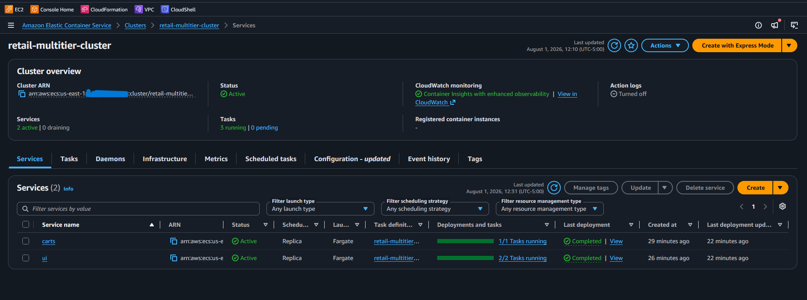
*Both ECS services at steady state with healthy task counts.*

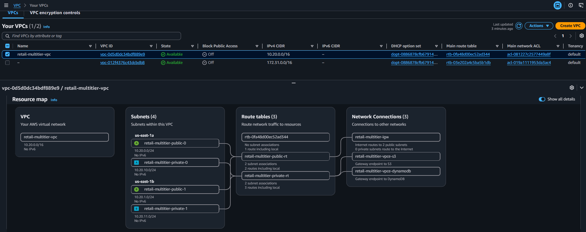
*The actual provisioned VPC layout, subnets, route tables, and endpoints, matching the architecture diagram above.*

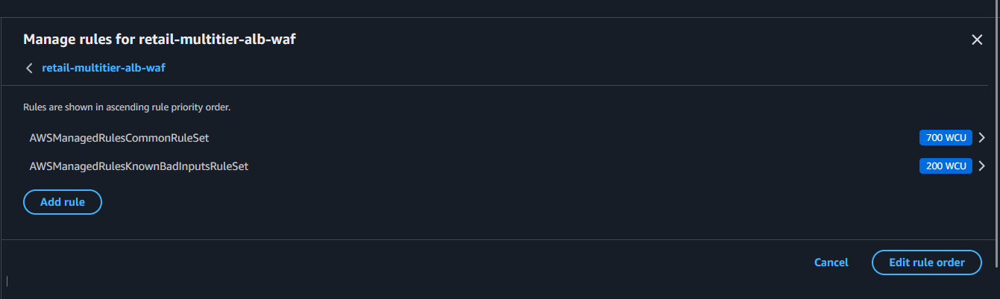
*The WAFv2 web ACL, showing both the Common Rule Set and the Log4j-specific Known Bad Inputs rule group attached to the ALB.*

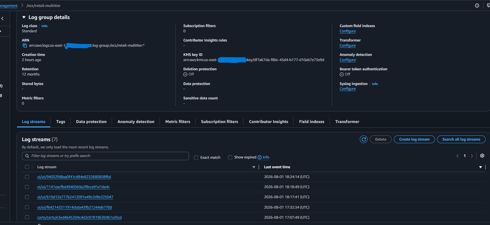
*Live application logs in the KMS-encrypted CloudWatch log group.*

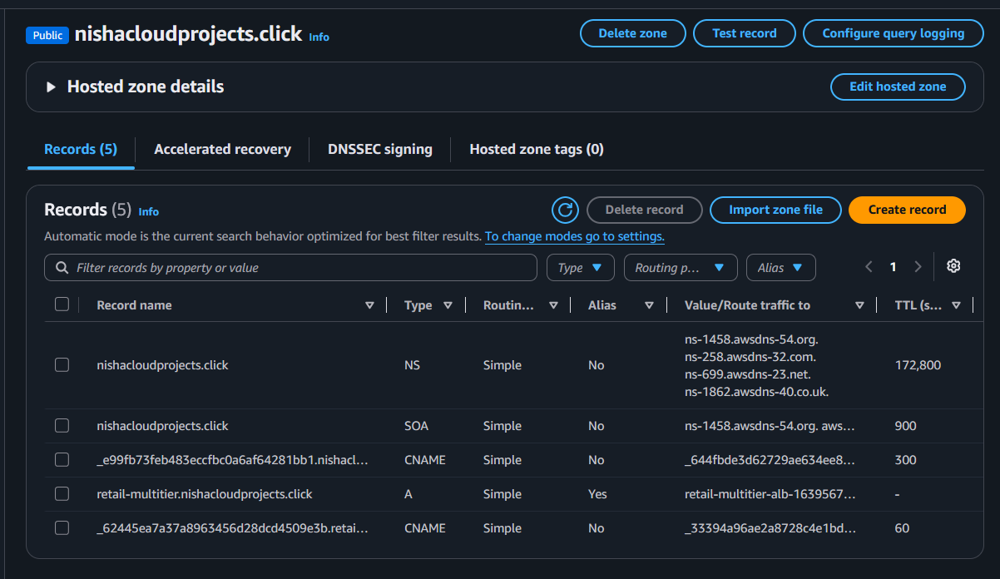
*The DNS records OpenTofu created automatically: the ACM validation CNAME and the ALB alias record.*

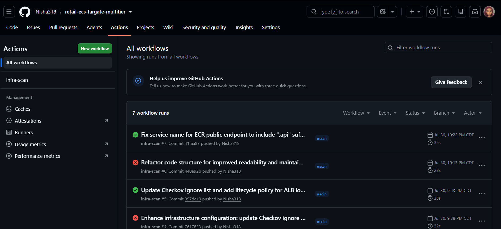
*The CI pipeline passing clean, Checkov, Gitleaks, and OIDC-authenticated Trivy scans against the private ECR mirror.*

### Phase 2

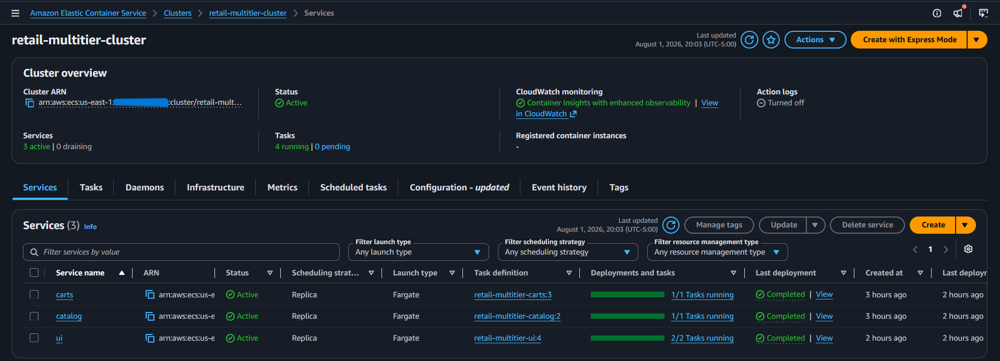
*UI, Carts, and Catalog all showing "Completed" deployment status with stable task counts.*

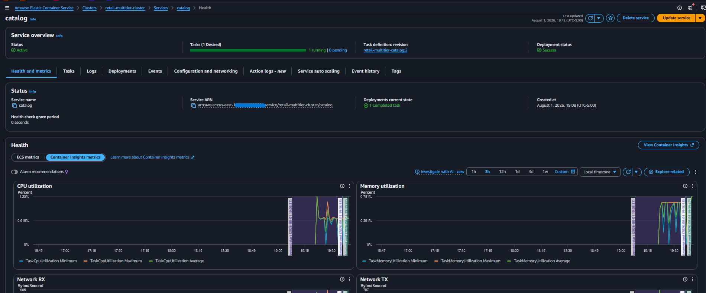
*Catalog's health check passing consistently after the `/catalog/products` fix, with real CPU/memory utilization confirming genuine activity, not just a coincidental healthy status.*

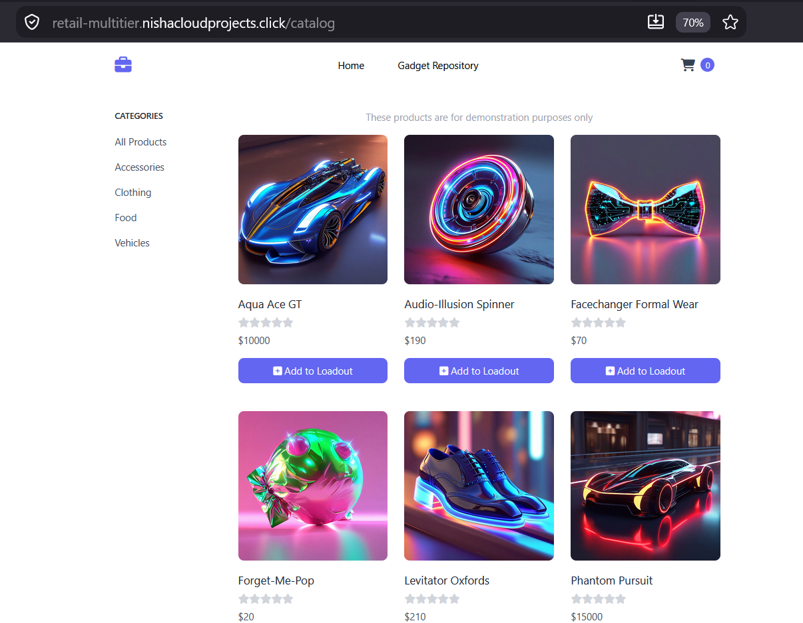
*The full Phase 2 chain confirmed end to end: browser to UI to Catalog to Aurora MySQL, rendering data GORM auto-seeded on startup, not placeholder content.*

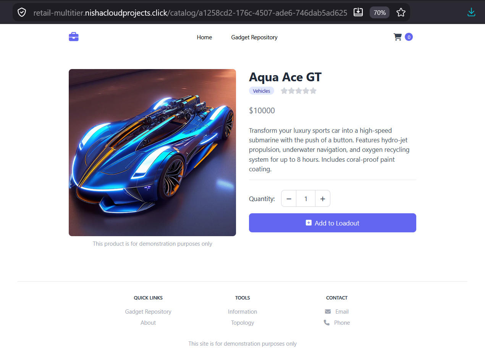
*A different code path than the listing page above (`GetProduct(id)` rather than `GetProducts`), confirming individual product lookups work too, not just the bulk listing query.*

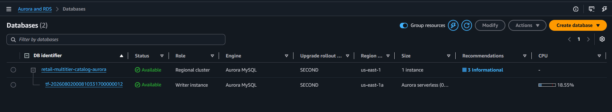
*Aurora Serverless v2 scaled up from its paused (0 ACU) state and actively serving, not just provisioned.*

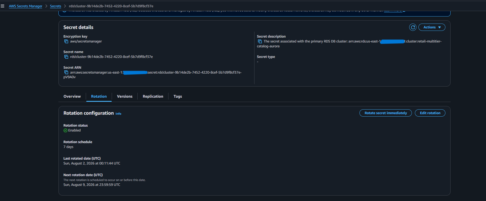
*The `rds!cluster-...` secret AWS generated and manages directly, confirming Terraform never touched the plaintext master password.*
