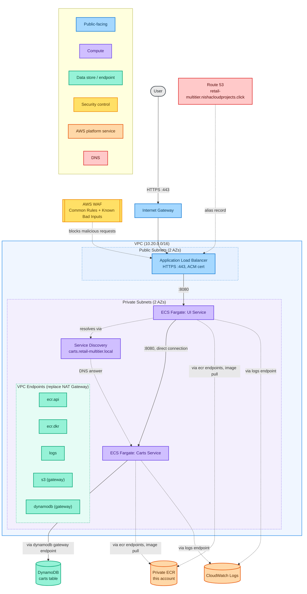
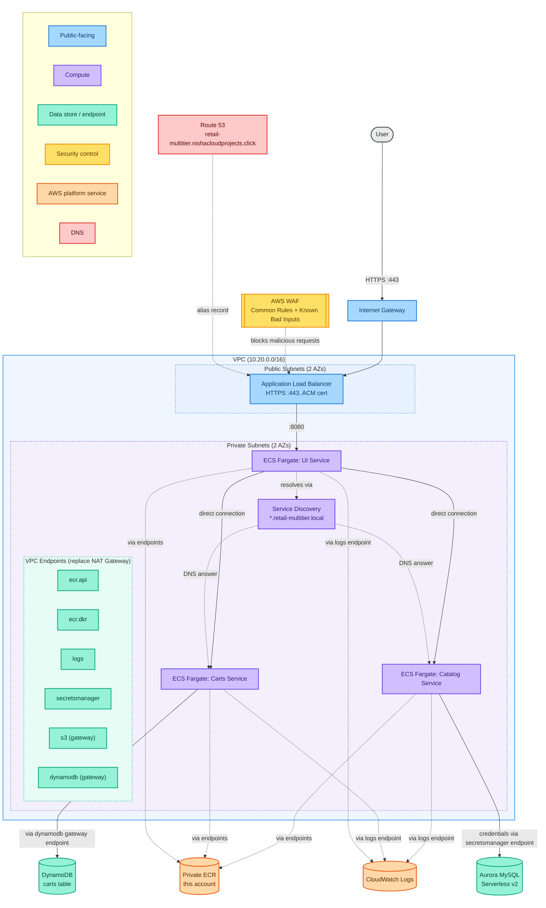
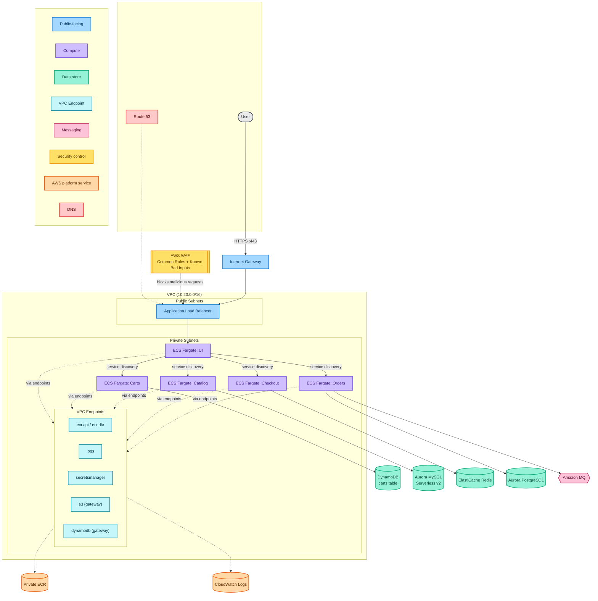
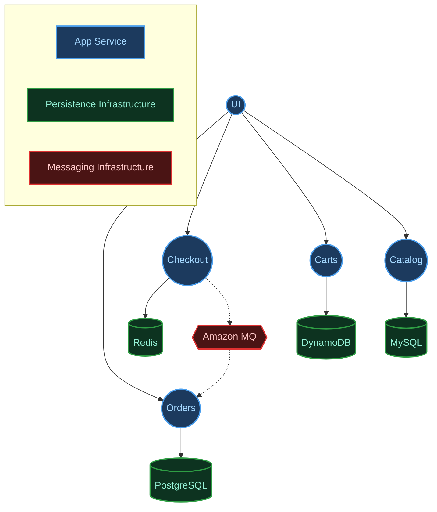
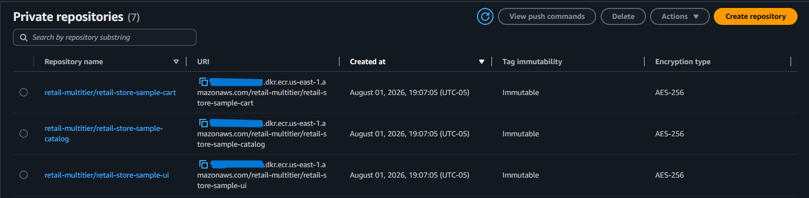
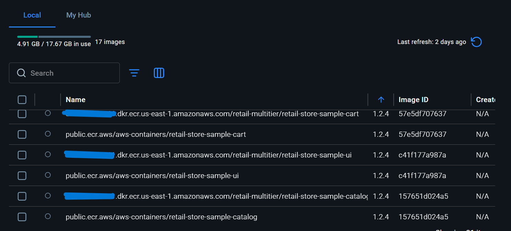

# Architecture Notes

See [`DECISIONS.md`](DECISIONS.md) for the full decision and debugging history behind this architecture, in ADR format. This document covers current architecture reference: diagrams, service scope, data store rationale, and cost, not the narrative of how each decision was reached.

## Diagram: Phase 1

Solid arrows are application traffic. Dashed arrows are infrastructure and control plane traffic (image pulls, log shipping) that would normally require a NAT Gateway but is routed through VPC endpoints instead in this build. Task definitions pull from a private ECR mirror in this account, not directly from `public.ecr.aws`; see [`DECISIONS.md`](DECISIONS.md) (ADR-006) for why.

Frozen historical snapshot as of Phase 1 completion. Does not reflect later phases; see the Phase 2 diagram below and Target Architecture further down for the current and planned state.

## Diagram: Phase 2

Frozen historical snapshot as of Phase 2 completion, adding Catalog and Aurora MySQL Serverless v2 to the Phase 1 diagram above. Secrets Manager reached via VPC interface endpoint, same PrivateLink pattern as everything else, no NAT Gateway involved. Catalog's dedicated task execution role (not the shared one UI/Carts use) is not visible on this diagram since it's an IAM-level detail rather than a network one; see [`DECISIONS.md`](DECISIONS.md) (ADR-003) for that decision.

## Services in scope

**UI**: mirrored from public.ecr.aws/aws-containers/retail-store-sample-ui into a private ECR repository ([`ecr.tf`](../infra/ecr.tf)), which is what the running task definition actually pulls from
Frontend service. Routes to Catalog and Carts. Catalog-dependent pages, previously unresolved in Phase 1 since Catalog wasn't deployed yet, now render correctly, confirmed via a live screenshot of `/catalog` showing real Aurora-backed product data (see Deployment evidence, Phase 2).

**Carts**: mirrored from public.ecr.aws/aws-containers/retail-store-sample-cart (confirmed singular repository name via `docker pull`) into a private ECR repository, same as UI
Supports either MongoDB or DynamoDB as a persistence backend. This build uses DynamoDB.

**Catalog**: mirrored from public.ecr.aws/aws-containers/retail-store-sample-catalog into a private ECR repository, same pattern as UI/Carts
Go service, MySQL persistence. Uses Aurora MySQL Serverless v2 (see Data store rationale below, and [`aurora.tf`](../infra/aurora.tf) for the actual configuration). Auto-migrates its own schema and seeds itself with demo product/tag data on startup via GORM, confirmed via `repository.go` before deploying, no manual schema or seed step required.

## DynamoDB table schema

Reused from AWS's own ECS Immersion Day CloudFormation template (confirmed accurate from that source):

- Table name: `retail-store-ecs-carts` (rename per this project's convention before apply)
- Partition key: `id` (String)
- Billing mode: PAY_PER_REQUEST
- GSI: `idx_global_customerId`, partition key `customerId` (String), projects ALL

## Target architecture (all phases)

The diagrams above show Phase 1 and Phase 2 as they were actually deployed. This is the full five-service target this project builds toward across Phases 1 through 3, shown at the infrastructure level, same style, extended.

*Full target infrastructure across all three phases. Phase 1 (UI, Carts) and Phase 2 (+ Catalog, Aurora MySQL) are deployed and verified; Checkout and Orders are planned for Phase 3. Solid arrows are application traffic; dashed arrows are infrastructure and control-plane traffic routed through VPC endpoints.*

## Logical service architecture

The diagrams above show AWS infrastructure, VPCs, subnets, endpoints, the physical deployment. They answer "what's provisioned and how does it connect at the network level." They deliberately don't answer a different, equally important question: which service owns which data, and why. That's a separate concern worth its own diagram rather than overloading the infrastructure ones.

*Logical service-to-datastore dependencies, independent of AWS specifics. This is the view that explains the polyglot persistence decisions below: each service owns its data exclusively, and the technology choice per service follows from its access pattern, not from AWS's infrastructure options.*

## Data store rationale

Four of the five services in the full architecture each use a different data store, chosen to match how that service actually reads and writes data rather than standardizing on one database technology across the board. The fifth, UI, deliberately owns no data store of its own, it aggregates data from the other four services via API calls, which is exactly why it has no row in the table below.

| Service | Access pattern | Store chosen |
|---|---|---|
| Carts | Simple key-value lookups by cart ID, high write volume, no complex joins | DynamoDB |
| Catalog | Structured product data, relational queries | Aurora MySQL |
| Orders | Transactional integrity, relational queries | Aurora PostgreSQL |
| Checkout | Fast ephemeral session and cache data | Redis |

**Carts, DynamoDB.** Access is almost entirely single-item lookups by cart ID, high write volume, no joins. The Carts table uses partition key `id` for the primary access path and a GSI on `customerId` as a secondary lookup, a standard single-table DynamoDB design for this access pattern.

**Catalog, Aurora MySQL.** Product data is relational: categories, hierarchies, and filtered queries across multiple related tables. Aurora Serverless v2 scales to the bursty read traffic typical of a browsing-heavy catalog service, with writes (product updates) comparatively rare.

**Orders, Aurora PostgreSQL.** This is the service where correctness has real consequences. ACID transactions are the core requirement, which both Aurora engines provide. Postgres over MySQL here reflects its typically stricter typing and more advanced constraint handling, appropriate for the source-of-truth service in the system. Splitting Catalog and Orders across two different Aurora engines is itself a form of polyglot persistence within the relational category.

**Checkout, Redis.** Checkout state is short-lived by design: it matters intensely for a few minutes during an active checkout and is worthless afterward. Redis gives sub-millisecond access during a latency-sensitive flow, with TTL expiration handling the data's natural lifecycle, without paying for a durable relational store for data meant to disappear.

Reference: AWS Prescriptive Guidance, [Enabling data persistence in microservices](https://docs.aws.amazon.com/prescriptive-guidance/latest/modernization-data-persistence/introduction.html)

## Cost profile

### Phase 1 (approximate, us-east-1)

- No NAT Gateway (removes about $32 to $96 per month plus data processing, versus the workshop's 3x NAT setup)
- ALB: about $16 to $20 per month baseline plus LCU usage
- Fargate (2 services, minimal task size, not running 24/7): pennies per hour while active
- DynamoDB PAY_PER_REQUEST: near zero at this usage scale
- VPC interface endpoints: hourly charge per endpoint per AZ, about $7 to $8 per month each. VPC endpoints are not automatically cheaper than a single NAT Gateway at low service counts; the economics shift as more services and endpoints are added in later phases.

### Phase 2 additions (approximate, us-east-1)

- Fargate (Catalog, minimal task size, not running 24/7): pennies per hour while active, same as UI/Carts
- Secrets Manager interface endpoint: about $7 to $8 per month, same pattern as the other interface endpoints
- **Aurora MySQL Serverless v2**, the real cost driver added in this phase:
  - Compute: $0.12 per ACU-hour (Aurora Standard, us-east-1). `min_capacity = 0` is set deliberately (see `aurora.tf`), enabling auto-pause when idle, so cost while genuinely idle is near zero rather than the $0.5-ACU always-on floor (~$43.80/month) a non-zero minimum would carry.
  - Storage: $0.10/GB-month, continues even while paused, but trivial for a small product catalog dataset.
  - I/O: $0.20 per million requests, also trivial at dev/test query volumes.
  - Practical effect for this project's actual usage pattern (deployed, tested, torn down, not left running): cost is roughly *(minimum ACU while active) × (hours actually deployed) × $0.12*, well under a dollar for a typical debugging session.

## Deployment evidence

### Phase 1

*Both ECS services at steady state with healthy task counts.*

*The actual provisioned VPC layout, subnets, route tables, and endpoints, matching the architecture diagram above.*

*The WAFv2 web ACL, showing both the Common Rule Set and the Log4j-specific Known Bad Inputs rule group attached to the ALB.*

*Live application logs in the KMS-encrypted CloudWatch log group.*

*The DNS records OpenTofu created automatically: the ACM validation CNAME and the ALB alias record.*

*The CI pipeline passing clean, Checkov, Gitleaks, and OIDC-authenticated Trivy scans against the private ECR mirror.*

### Phase 2

*UI, Carts, and Catalog all showing "Completed" deployment status with stable task counts.*

*Catalog's health check passing consistently after the `/catalog/products` fix, with real CPU/memory utilization confirming genuine activity, not just a coincidental healthy status.*

*The full Phase 2 chain confirmed end to end: browser to UI to Catalog to Aurora MySQL, rendering data GORM auto-seeded on startup, not placeholder content.*

*A different code path than the listing page above (`GetProduct(id)` rather than `GetProducts`), confirming individual product lookups work too, not just the bulk listing query.*

*Aurora Serverless v2 scaled up from its paused (0 ACU) state and actively serving, not just provisioned.*

*The `rds!cluster-...` secret AWS generated and manages directly, confirming Terraform never touched the plaintext master password.*

*The private ECR mirror described in [`DECISIONS.md`](DECISIONS.md) (ADR-006), now complete across all three services. Confirms two Terraform-configured settings actually took effect: immutable tags (`image_tag_mutability = "IMMUTABLE"`) and the deliberate AES-256 encryption choice documented under CKV_AWS_136, not just default AWS-managed encryption nobody thought about.*

*The actual mirroring claim made visible: identical Image IDs between each public source image and its private mirror (cart, ui, catalog), confirming the mirror script produces byte-identical copies, not just repositories with matching names and tags.*
